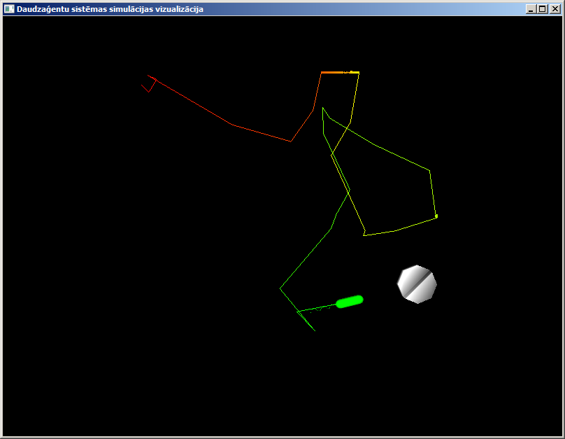
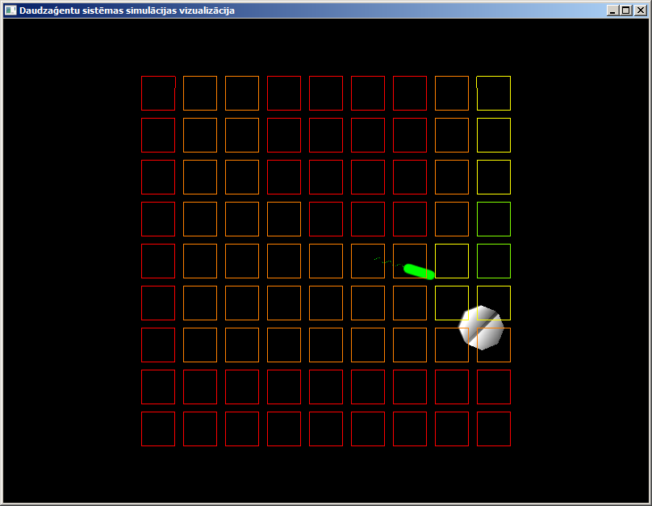
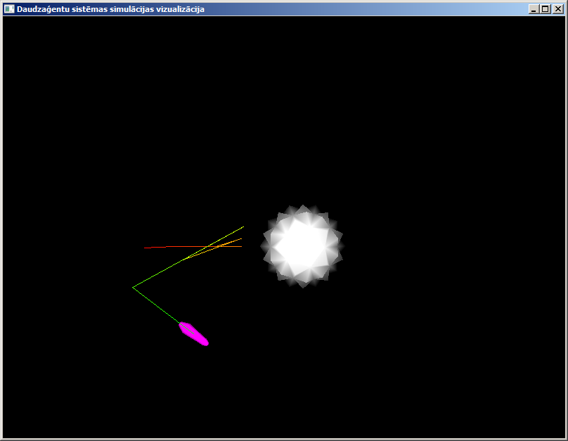

# Daudzaģentu sistēmas simulācijas pirmkods

Repozitorijā atrodas visu rīku pirmkods, sakompilētās versijas, visi simulācijas
scenāriji, automātiski ģenerētā dokumentācija.

Visas programmas kompilētas priekš Windows 64 bitu versijas. Vizualizācijai
nepieciešama grafikas karte ar OpenGL 4.0 atbalstu.

[Dokumentācija tīmekļa vidē.](https://racenis.github.io/daudzagenti/doxygen/files.html)

## Bibliotēka

Pirmkods atrodas direktorijā `library`. Turpat var atrast arī jau nokompilētu
bibliotēkas versiju `repl.exe`.

Programma `repl` ielādēs pasaules un dažu aģentu definīcijas, tad ieies ciklā,
kurā tā prasīs ievadīt komandu interpretatoram, tad to interpretēs un tad 
nosimulēs vienu simulācijas takti.

Neierakstot nekādu komandu, interpretators ignorēs to un simulēs vienu simulācijas
takti. Ierakstot komandu `exit` interpretators beigs darbu.

## Vizualizācija

Pirmkods atrodas direktorijā `client`.

## Pārvaldības lietotne

Pirmkods atrodas direktorijā `editor`.

Tur var arī atrast `editor.exe`.

## Simulācijas scenāriji

Simulācijas pasaules definīcija atrodas `worlds` direktorijā, aģentu definīcijas
atrodas `agents` direktorijā.

Lai palaistu secenārijus, vispirms nepieciešams komandrindas darba direktoriju
iestatīt uz `client` direktoriju.

### Baktērijas simulācija

`client -setup forbidden-gherkin.setup`

Lai parādītu arī glikozes gradientu:

`client -setup forbidden-gherkin.setup -chemical glucose`

### Vienšūņa simulācija

`client -setup animalcule.setup`

Lai parādītu vienšūņa trajektoriju:

`client -setup animalcule.setup -track animalcule-agent`

Pirms atpauzē ar `Space`, nepieciešams nospies `5` lai ieslēgtu aģentu
trajektoriju attēlošanu.

### Tastatūras ievadi

`Space` -- pauzēt/atpauzēt.

`W/A/S/D/Q/E` -- kustināt virtuālo kameru.

`1/2/3/4/5` -- ieslēgt/izslēgt dažādas vizualizācijas.